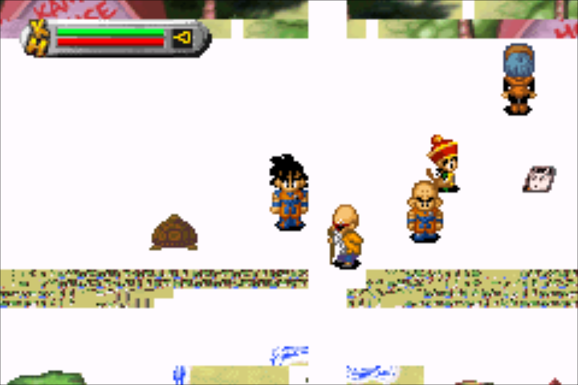
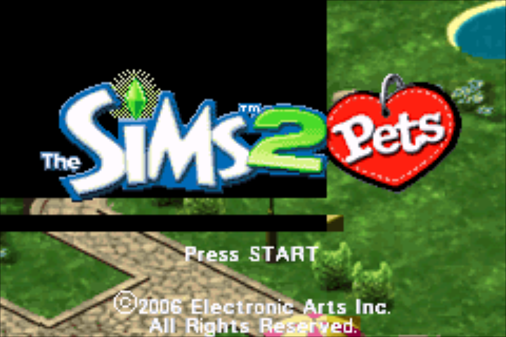
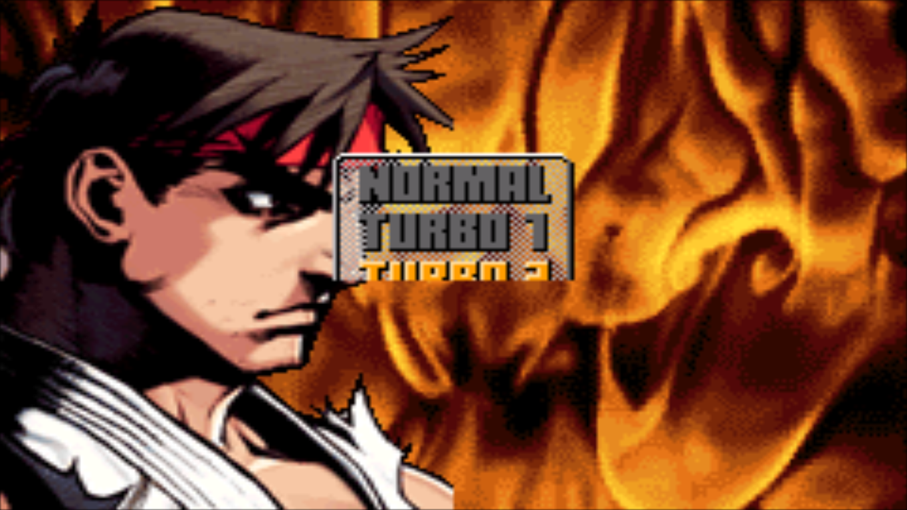

# Game Boy Advance (gpSP)

## Contribute to this documentation

In order to propose improvements to this document, [visit its corresponding source page on github](https://github.com/libretro/docs/tree/master/docs/library/gpsp.md). Changes are proposed using "Pull Requests."

There is a To-Do list for libretro/docs [here](https://buildbot.libretro.com/.docs/docguide/todo/)

## Background

gpSP is a Game Boy Advance emulator based on notaz' fork of gpSP with additional codebase improvements.

### Why use this core?

Awaiting description.

### How to get and install the gpSP core:

1. Start up RetroArch. Inside the main menu, go to 'Online Updater'.

2. Just to make sure we have the latest info files, select 'Update Core Info FIles'. Wait until this is done. Then, select 'Core Updater'.

3. Browse through the list and select 'Game Boy Advance (gpSP)'.

After this has finished downloading, the core should now be ready for use!

#### How to start (after installation):

1. Go back to RetroArch's main menu screen. Select 'Load Content'.

2. Browse to the folder that contains the content you want to run.

3. Select the content that you want to run.

4. If you are asked which core to select, choose 'Game Boy Advance (gpSP)'.

The content should now start running!

### Authors

- Exophase

## See also

### GBA

- [Game Boy Advance (Beetle GBA)](https://docs.libretro.com/library/beetle_gba/)
- [Game Boy Advance (gpSP)](https://docs.libretro.com/library/gpsp/)
- [Game Boy Advance (Meteor)](https://docs.libretro.com/library/meteor/)
- [Game Boy Advance (mGBA)](https://docs.libretro.com/library/mgba/)
- [Game Boy Advance (VBA Next)](https://docs.libretro.com/library/vba_next/)
- [Game Boy Advance (VBA-M)](https://docs.libretro.com/library/vbam/)

## License

A summary of the licenses behind RetroArch and its cores have found [here](https://docs.libretro.com/tech/licenses/).

- [GPLv2](https://github.com/libretro/gpsp/blob/master/COPYING)

## Extensions

Content that can be loaded by the gpSP core have the following file extensions:

- .gba
- .bin

## Databases

RetroArch database(s) that are associated with the gpSP core:

- [Nintendo - Game Boy Advance](https://github.com/libretro/libretro-database/blob/master/rdb/Nintendo%20-%20Game%20Boy%20Advance.rdb)

## BIOS

Required or optional firmware files go in RetroArch's system directory.

|   Filename    |    Description                    |              md5sum              |
|:-------------:|:---------------------------------:|:--------------------------------:|
| gba_bios.bin  | Game Boy Advance Image - Required | a860e8c0b6d573d191e4ec7db1b1e4f6 |

## Features

RetroArch features that the gpSP core respects.

| Feature           | Supported |
|-------------------|:---------:|
| Restart           | ✔         |
| Screenshots       | ✔         |
| Saves             | ✔         |
| States            | ✔         |
| Rewind            | ✔         |
| Netplay           | ✔ (not link-cable emulation) |
| Core Options      | ✕         |
| RetroAchievements | ✕         |
| RetroArch Cheats  | ✕         |
| Native Cheats     | ✕         |
| Controls          | ✔         |
| Remapping         | ✔         |
| Multi-Mouse       | ✕         |
| Rumble            | ✕         |
| Sensors           | ✕         |
| Camera            | ✕         |
| Location          | ✕         |
| Subsystem         | ✕         |
| Softpatching      | ✕         |
| Disk Control      | ✕         |
| Username          | ✕         |
| Language          | ✕         |
| Crop Overscan     | ✕         |

### Directories

The gpSP core's directory name is 'gpSP'

The gpSP core loads from and saves to to these directories.

**RetroArch's Save directory**

- 'content-name'.sav (Cartridge backup save)

**RetroArch's State directory**

- 'content-name'.state# (State)

### Geometry and timing

The gpSP core's internal FPS is (FPS).

The gpSP core's internal sample rate is (Rate)

The gpSP core's core provided aspect ratio is (Ratio).

## Controllers

### Device types

The gpSP core supports the following device type(s) in the controls menu, bolded device types are the default for the specified user(s):

#### User 1 device types

- None - Doesn't disable input.
- **RetroPad** - Joypad
- RetroPad w/Analog - Joypad - **There's no reason to switch to this.**

### Controller tables

#### Joypad and analog device type table

| User 1 input descriptors      | RetroPad Inputs                              | RetroPad           |
|-------------------------------|----------------------------------------------|--------------------|
| B                             |        | B                  |
| Select                        |         | Select             |
| Start                         |          | Start              |
| D-Pad Up                      |        | D-Pad Up           |
| D-Pad Down                    |      | D-Pad Down         |
| D-Pad Left                    |      | D-Pad Left         |
| D-Pad Right                   |     | D-Pad Right        |
| A                             |        | A                  |

## Compatibility

| Game                                  | Issue                          |
|---------------------------------------|--------------------------------|
|**Activision Anthology**               |Freezes when entering a game. |
|**Banjo-Kazooie - Grunty's Revenge**   |Black screen during developer logo. Resets when Banjo leaves his house.|
|**Boktai Trilogy**                     |The solar sensor is not emulated. |
|**DemiKids - Light/Dark Version**      |Crashes when entering a battle. |
|**Digimon Racing (Europe)**            |Freezes during the intro.   |
|**Dragon Ball Z - The Legacy of Goku** |Graphics glitches. (1)  |
|**Final Fantasy VI**                   |Background/tiling order issues.  |
|**Game Boy Advance Video - Dragon Ball GT - Volume 1**|White screen.     |
|**Grand Theft Auto Advance**           |Crashes after first dialog.      |
|**Harry Potter - Quidditch World Cup** |Crashes when going ingame.       |
|**Koro Koro Puzzle Happy Panechu!**    |The tilt sensor is not emulated. |
|**Mario & Luigi - Superstar Saga**     |Crashes when entering a battle.  |
|**Phantasy Star Collection**           |Phantasy Star 1 flickers.        |
|**R-Type III - The Third Lightning**   |Softlocks at Irem startup screen.|
|**Rock 'n Roll Racing**                |Corrupted graphics, not playable.|
|**Rockman & Forte**                    |Doesn't continue after GBA BIOS screen.|
|**Sims 2, The - Pets**|Graphics glitches. Heavy flickering, black objects. (2)  |
|**Street Racing Syndicate**            |Freezes at startup screen, doesn't continue.|
|**Super Monkey Ball Jr.**              |Softlocks at startup screen.|
|**Super Street Fighter II Turbo/X Revival**|Small graphics glitch. Selecting speed 'Turbo 1' and beyond on the character select screen makes the game speed window not fully visible. (3)  |
|**Tales of Phantasia (USA version)**   |Softlocks during the introduction sequence (just before the small guy hits the tall guy in the right).|
|**WarioWare: Twisted!**                |The tilt sensor is not emulated.|
|**Wolfenstein 3D**                     |Softlocks at id Software startup screen.|
|**Yoshi’s Universal Gravitation**      |The tilt sensor is not emulated.|

??? note "(1)"
	

??? note "(2)"
	

??? note "(3)"
	

## External Links

- [Libretro gpSP Core info file](https://github.com/libretro/libretro-super/blob/master/dist/info/gpsp_libretro.info)
- [Libretro gpSP Github Repository](https://github.com/libretro/gpsp)
- [Report Libretro gpSP Core Issues Here](https://github.com/libretro/gpsp/issues)
- [Official gpSP Website](http://notaz.gp2x.de/other.php)
- [Official gpSP Github Repository](https://github.com/notaz/gpsp)
