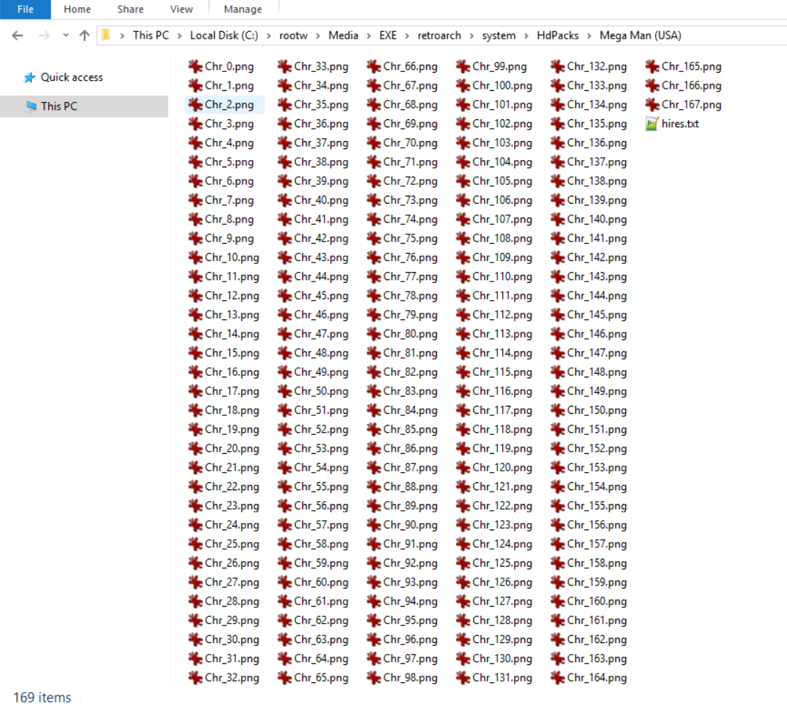

# NES / Famicom (Mesen)

## Contribute to this documentation

**DOCUMENTATION IS A WORK IN PROGRESS**

**In order to propose improvements to this document, [visit its corresponding source page on github](https://github.com/libretro/docs/tree/master/docs/library/mesen.md). Changes are proposed using "Pull Requests."**

**There is a To-Do list for libretro/docs [here](https://docs.libretro.com/docguide/todo/)**

**You can submit suggestions or issues regarding documentation at the [libretro/docs issue tracker](https://github.com/libretro/docs/issues) or in our [forum thread](https://forums.libretro.com/t/wip-adding-pages-to-documentation-site/10078/).**

## Background

Mesen is a cross-platform NES/Famicom emulator for Windows & Linux built in C++ and C#.

### How to install the Mesen core:

- Start up RetroArch. Inside the main menu, go to 'Online Updater'.

<center>  </center>

- Just to make sure we have the latest info files, select 'Update Core Info FIles'. Wait until this is done. Then, select 'Core Updater'.

<center>  </center>

- Browse through the list and select 'NES / Famicom (Mesen)'.

<center>  </center>

After this has finished downloading, the core should now be ready for use!

#### How to start the Mesen core:

- Go back to RetroArch's main menu screen. Select 'Load Content'.

<center>  </center>

- Browse to the folder that contains the content you want to run.

- Select the content that you want to run.

- If you are asked which core to select, choose 'NES / Famicom (Mesen)'.

The content should now start running!

### Authors

- M. Bibaud (aka Sour)

## See also

### NES/Famicom

- [NES / Famicom (bnes)](https://docs.libretro.com/library/bnes/)
- [NES / Famicom (Emux NES)](https://docs.libretro.com/library/emux_nes/)
- [NES / Famicom (FCEUmm)](https://docs.libretro.com/library/fceumm/)
- [NES / Famicom (Nestopia UE)](https://docs.libretro.com/library/nestopia_ue/)
- [NES / Famicom (QuickNES)](https://docs.libretro.com/library/quicknes/)

## License

A summary of the licenses behind RetroArch and its cores have found [here](https://docs.libretro.com/tech/licenses/).

The Mesen core is licensed under

- [GPLv3](https://github.com/SourMesen/Mesen/blob/master/README.md)

## Extensions

Content that can be loaded by the Mesen core have the following file extensions:

- .nes
- .fds
- .unf
- .unif

## Databases

RetroArch database(s) that are associated with the Mesen core:

- [Nintendo - Nintendo Entertainment System](https://github.com/libretro/libretro-database/blob/master/rdb/Nintendo%20-%20Nintendo%20Entertainment%20System.rdb)
- [Nintendo - Family Computer Disk System](https://github.com/libretro/libretro-database/blob/master/rdb/Nintendo%20-%20Family%20Computer%20Disk%20System.rdb)

## BIOS

Required or optional firmware files go in RetroArch's system directory.

|   Filename  |    Description                                                                        |              md5sum              |
|:-----------:|:-------------------------------------------------------------------------------------:|:--------------------------------:|
| disksys.rom | Family Computer Disk System BIOS - Required for Family Computer Disk System emulation | ca30b50f880eb660a320674ed365ef7a |

## Features

RetroArch-level settings or features that the Mesen core respects.

| Feature           | Supported |
|-------------------|:---------:|
| Restart           | ✕         |
| Screenshots       | ✔         |
| Saves             | ✔         |
| States            | ✔         |
| Rewind            | ✔         |
| Netplay           | ✔         |
| Core Options      | ✔         |
| RetroAchievements | ✔         |
| RetroArch Cheats  | ✔         |
| Native Cheats     | ✕         |
| Controls          | ✔         |
| Remapping         | ✕         |
| Multi-Mouse       | ✕         |
| Rumble            | ✕         |
| Sensors           | ✕         |
| Camera            | ✕         |
| Location          | ✕         |
| Subsystem         | ✕         |
| [Softpatching](https://docs.libretro.com/guides/softpatching/) | ✕\         |
| Disk Control      | ✕         |
| Username          | ✕         |
| Language          | ✕         |
| Crop Overscan     | ✕         |
| LEDs              | ✕         |

### Directories

The Mesen core's directory name is 'Mesen'

The Mesen core saves/loads to/from these directories.

**RetroArch's Home directory**

- retroarch-core-options.cfg (Core-options)

**RetroArch's Config directory**

- Mesen.cfg (Core Overrides)
- 'content-name'.cfg (Game Overrides)
- 'content-name'.opt (Game-options)

**RetroArch's Input Remapping directory**

- Mesen.rmp (Core Remap)
- 'content-name'.rmp (Game Remap)

**RetroArch's Video Shader directory**

- Mesen.'shader-preset-extension' (Core Shader Preset)
- 'content-name'.'shader-preset-extension' (Game Shader Preset)

**RetroArch's Save directory**

- 'content-name'.srm (Cartridge battery save)
- 'content-name'.sav (Cartridge battery save)

**RetroArch's State directory**

- 'content-name'.state# (State)

**RetroArch's System directory**

```
HdPacks/'content-name'/
						- HD pack files
```

### Geometry and timing

- The Mesen core's core provided FPS is 60 for NTSC games and 50 for PAL games.
- The Mesen core's core provided sample rate is 48000 Hz
- The Mesen core's core provided aspect ratio is dependent on the ['Aspect Ratio' core option](https://docs.libretro.com/mesen/#core-options).

### HD packs

!!! warning
	To use HD packs, first make sure to turn on the [Enable HD Packs core option](https://docs.libretro.com/library/mesen/#core-options.)

- First, create a folder named 'HdPacks' in RetroArch's System directory.

- Next, create a folder inside the HdPacks directory that has the same name as the content you're going to load.

- So, if the content you're loading is Mega Man (USA).nes, the folder should be named 'Mega Man (USA)'.

- Finally, extract the HD pack content files to the Mega Man (USA) folder.
	
Here's an example of a working HD pack setup done with [Mega Man 1 (NES) - 30th Anniversary 16-bit Graphic Pack](https://www.romhacking.net/forum/index.php?topic=25426.0). Pay attention to the file path.



!!! attention
	There is more HD pack documentation at the [official Mesen documentation](https://www.mesen.ca/docs/hdpacks/#using-hd-packs).

## Core options

The Mesen core has the following option(s) that can be tweaked from the core options menu. The default setting is bolded. 

Settings with (Restart) means that core has to be closed for the new setting to be applied on next launch.

!!! attention
	These core option descriptions have been sourced from the [official Mesen documentation](https://www.mesen.ca/docs/). Please go there for more information.

- **NTSC filter** [mesen_ntsc_filter] (**Disabled**/Composite (Blargg)/S-Video (Blargg)/RGB (Blargg)/Monochrome (Blargg)/Bisqwit 2x/Bisqwit 4x/Bisqwit 8x)

	Selects a filter to apply to the picture.
	
	Blargg filters are fast.
	
	Bisqwit filters are slower.

- **NTSC filter: Vertical blending** [mesen_ntsc_vertical_blend] (**Off**/On)

	Toggle vertical resolution blending in NTSC fllters.

- **Palette** [mesen_palette] (**Default**/Composite Direct (by FirebrandX)/Nes Classic/Nestopia (RGB)/Original Hardware (by FirebrandX)/PVM Style (by FirebrandX)/Sony CXA2025AS/Unsaturated v6 (by FirebrandX)/YUV v3 (by FirebrandX))

	Mesen comes with a number of built-in palette options - you can select them from here.

- **Overclock** [mesen_overclock] (**None**/Low/Medium/High/Very High)

	Use this to overclock or underclock the CPU.

!!! warning
	Overclocking can cause issues in some games.

- **Overclock Type** [mesen_overclock_type] (**Before NMI (Recommended)**/After NMI)

	Before NMI: Increases the number of scanlines in the PPU, before the NMI signal is triggered at the end of the visible frame. This effectively gives more time for games to perform calculations, which can reduce slowdowns in games. **This is the preferred option for overclocking.**
	
	After NMI: Increases the number of scanlines in the PPU, after the NMI signal is triggered at the end of the visible frame. This effectively gives more time for games to perform calculations, which can reduce slowdowns in games. **This option is less compatible and should only be used if the before NMI variation does not work as expected.**

- **Region** [mesen_region] (**Auto**/NTSC/PAL/Dendy)

	When set to Auto, the emulator will try to detect the game’s region (NTSC or PAL) - however, this is not always possible. When there is nothing to suggest a game is for the PAL region (Australia & Europe), the NTSC region (North America & Japan) will be used by default. Dendy is used to mimic a number of different NES clones, in particular, the Dendy, which was a popular clone in Russia.

- **Vertical Overscan** [mesen_overscan_vertical] (**None**/8px/16px)

	This overscan setting allow you to cut out pixels vertically on any edge of the screen. On a CRT TV, a few pixels on each side of the screen was usually invisible to the player. Because of this, games often have glitches or incorrect palette colors on the edges of the screen – this is normal and caused by the game itself. Setting a value of 8 or so on each side of the overscan configuration will usually hide most glitches.
	
- **Horizontal Overscan** [mesen_overscan_horizontal] (**None**/8px/16px)
	
	This overscan setting allow you to cut out pixels horizontally on any edge of the screen. On a CRT TV, a few pixels on each side of the screen was usually invisible to the player. Because of this, games often have glitches or incorrect palette colors on the edges of the screen – this is normal and caused by the game itself. Setting a value of 8 or so on each side of the overscan configuration will usually hide most glitches.	

- **Aspect Ratio** [mesen_aspect_ratio] (**Auto**/No Stretching/NTSC/PAL/4:3/16:9)

	The NES’ internal aspect ratio is almost square (Default (No Stretching)), but it used to be displayed on CRT TVs that had a rectangular picture. To simulate a CRT TV, you can use the Auto option - it will switch between NTSC and PAL aspect ratios depending on the game you are playing. Using anything other than the Default (No Stretching) option may cause pixels to have irregular sizes. You can reduce this effect by using a combination of video filters and the bilinear filtering option.

- **Controller Turbo Speed** [mesen_controllerturbospeed] (**Fast**/Very Fast/Slow/Normal)

	Configure the controller's turbo buttons' speed.

- **Enable HD Packs** [mesen_hdpacks] (Off/**On**)

	Enables the use of [HD packs](https://www.mesen.ca/docs/hdpacks/). [Look at the HD packs section for more information](https://docs.libretro.com/library/mesen/#hd-packs).

- **Remove sprite limit** [mesen_nospritelimit] (Off/**On**)

	The NES can normally only draw up to 8 sprites per line – this limitation is indirectly responsible for some of the flickering seen in games at times. When this option is enabled, the limit is disabled, allowing up to 64 sprites to be drawn on the same line.

- **Enable fake stereo effect** [mesen_fake_stereo] (**Off**/On)

	Self-explanatory.
	
- **Reduce popping on Triangle channel** [mesen_mute_triangle_ultrasonic] (Off/**On**)

	This option mutes the triangle channel under certain conditions, which prevents it from causing popping sounds.
	
- **Reduce popping on DMC channel** [mesen_reduce_dmc_popping] (Off/**On**)

	Similar to the previous option, but for the DMC channel – this option prevents games from changing the output of the DMC channel too abruptly, which often causes popping sounds.

- **Swap Square channel duty cycles** [mesen_swap_duty_cycle] (**Off**/On)

	This option is to mimic some older NES clones that had incorrect sound output for both of the square channels. It greatly alters the sound in some games, and shouldn’t be enabled unless you want this behavior.

- **Disable Noise channel mode flag** [mesen_disable_noise_mode_flag] (**Off**/On)

	Very early Famicom models did not implement this feature, so this option is available to mimic early Famicom consoles. It changes the sound output of the noise channel in some games, and shouldn’t be enabled unless you want this behavior.
	
- **Screen Rotation** [mesen_screenrotation] (**None**/90 degrees/180 degrees/270 degrees)

	Rotates the display by the specified angle. This is useful to play games (generally homebrew games) designed for a vertical display.

- **Default power-on state for RAM** [mesen_ramstate] (**All 0s (Default)**/All 1s/Random Values)

	On a console, the RAM’s state at power on is undetermined and relatively random. This option lets you select Mesen’s behavior when initializing RAM - set all bits to 0, set all bits to 1, or randomize the value of each bit.

- **FDS: Automatically insert disks** [mesen_fdsautoinsertdisk] (**Off**/On)

	By default, the FDS boots with no disk inserted in the drive. This option makes it so the player does not need to manually insert disk 1, side A manually.

- **FDS: Fast forward while loading** [mesen_fdsfastforwardload] (**Off**/On)

	FDS games contain a large number of load screens due to their data being stored on floppy drives. Mesen needs to emulate this floppy drive’s speed to ensure accurate emulation. This option makes it so Mesen runs the emulation as fast as it can when a game is loading data from the disk, which greatly reduces the time spent on loading screens.

## Controllers

The Mesen core supports the following device type(s) in the controls menu, bolded device types are the default for the specified user(s):

### User # - # device types

- None - Doesn't disable input
- **RetroPad** - Joypad
- RetroPad w/Analog - Joypad - There's no reason to switch to this.

### Controller tables

#### Joypad

| User # Remap descriptors | RetroPad Inputs                              | RetroPad               |
|--------------------------|----------------------------------------------|------------------------|
|                          |        | B                      |
|                          |        | A                      |
|                          |         | Select                 |
|                          |          | Start                  |
|                          |        | D-Pad Up               |
|                          |      | D-Pad Down             |
|                          |      | D-Pad Left             |
|                          |     | D-Pad Right            |
|                          |        | Turbo B                |
|                          |        | Turbo A                |
|                          |             | (FDS) Insert Next Disk |
|                          |             | (FDS) Switch Disk Side |
|                          |             | (VS) Insert Coin 0     |
|                          |             | (VS) Insert Coin 1     |

!!! attention
	The (FDS) Insert Next Disk and (FDS) Switch Disk Side inputs will NOT do anything while the ['FDS: Automatically insert disks' core option](https://docs.libretro.com/library/mesen/#core-options) is enabled.

#### Mouse

| RetroMouse Inputs                                   | Zapper           |
|-----------------------------------------------------|------------------|
|  Mouse Cursor | Zapper Crosshair |
|  Mouse 1       | Zapper Trigger   |

## Compatibility

[Mesen Compatibility List](https://www.mesen.ca/#Compatibility)

## External Links

- [Libretro Mesen Core info file](https://github.com/libretro/libretro-super/blob/master/dist/info/mesen_libretro.info)
- [Official Mesen Github Repository](https://github.com/SourMesen/Mesen)
- [Report Libretro Mesen Core Issues Here](https://github.com/SourMesen/Mesen/issues)
- [Official Mesen Website](https://www.mesen.ca/)
- [Official Mesen Documentation](https://www.mesen.ca/docs/)
- [Official Mesen Downloads](https://www.mesen.ca/#Downloads)
- [Official Mesen Changelog](https://www.mesen.ca/#Changelog)