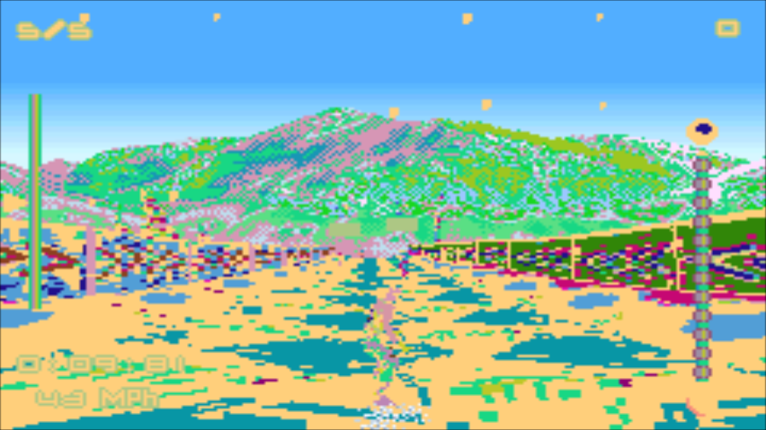

# Game Boy Advance (VBA Next)

## Contribute to this documentation

**DOCUMENTATION IS A WORK IN PROGRESS**

**In order to propose improvements to this document, [visit its corresponding source page on github](https://github.com/libretro/docs/tree/master/docs/library/vba_next.md). Changes are proposed using "Pull Requests."**

**There is a To-Do list for libretro/docs [here](https://docs.libretro.com/docguide/todo/)**

**You can submit suggestions or issues regarding documentation at the [libretro/docs issue tracker](https://github.com/libretro/docs/issues) or in our [forum thread](https://forums.libretro.com/t/wip-adding-pages-to-documentation-site/10078/).**

## Background

VBA-Next is a Game Boy Advance emulator based on VBA-M 2011 with backported patches for performance and compatibility improvements.

### Why use this core?

Awaiting description.

### How to install the VBA Next core:

- Start up RetroArch. Inside the main menu, go to 'Online Updater'.

  

- Just to make sure we have the latest info files, select 'Update Core Info FIles'. Wait until this is done. Then, select 'Core Updater'.

  

- Browse through the list and select 'Game Boy Advance (VBA Next)'.

  

After this has finished downloading, the core should now be ready for use!

#### How to start the (Core name) core:

- Go back to RetroArch's main menu screen. Select 'Load Content'.

  

- Browse to the folder that contains the content you want to run.

- Select the content that you want to run.

- If you are asked which core to select, choose 'Game Boy Advance (VBA Next)'.

The content should now start running!

### Authors

- Forgotten
- VBA-M Team
- Squarepusher

## See also

### GBA

- [Game Boy Advance (Beetle GBA)](https://docs.libretro.com/library/beetle_gba/)
- [Game Boy Advance (gpSP)](https://docs.libretro.com/library/gpsp/)
- [Game Boy Advance (Meteor)](https://docs.libretro.com/library/meteor/)
- [Game Boy Advance (mGBA)](https://docs.libretro.com/library/mgba/)
- [Game Boy Advance (VBA-M)](https://docs.libretro.com/library/vba_m/)

## License

A summary of the licenses behind RetroArch and its cores have found [here](https://docs.libretro.com/tech/licenses/).

The VBA Next core is licensed under

- GPLv2

## Extensions

Content that can be loaded by the VBA Next core have the following file extensions:

- .gba

## Databases

RetroArch database(s) that are associated with the VBA Next core:

- [Nintendo - Game Boy Advance](https://github.com/libretro/libretro-database/blob/master/rdb/Nintendo%20-%20Game%20Boy%20Advance.rdb)

## BIOS

Required or optional firmware files go in RetroArch's system directory.

|   Filename    |    Description                    |              md5sum              |
|:-------------:|:---------------------------------:|:--------------------------------:|
| gba_bios.bin  | Game Boy Advance Image - Optional | a860e8c0b6d573d191e4ec7db1b1e4f6 |

!!! warning
	In order for the Game Boy Advance BIOS to be used, the 'Use bios if available' core option must be set to On.

## Features

RetroArch-level settings or features that the VBA Next core respects.

| Feature           | Supported |
|-------------------|:---------:|
| Restart           | ✔         |
| Screenshots       | ✔         |
| Saves             | ✔         |
| States            | ✔         |
| Rewind            | ✔         |
| Netplay           | ✔ (not link-cable emulation) |
| Core Options      | ✔         |
| RetroAchievements | ✔         |
| RetroArch Cheats  | ✕         |
| Native Cheats     | ✕         |
| Controls          | ✔         |
| Remapping         | ✔         |
| Multi-Mouse       | ✕         |
| Rumble            | ✕         |
| Sensors           | ✕         |
| Camera            | ✕         |
| Location          | ✕         |
| Subsystem         | ✕         |
| Softpatching      | ✔         |
| Disk Control      | ✕         |
| Username          | ✕         |
| Language          | ✕         |
| Crop Overscan     | ✕         |
| LEDs              | ✕         |

### Directories

The VBA Next core's directory name is 'VBA Next'

The VBA Next core saves/loads to/from these directories.

**RetroArch's Config directory**

- VBA Next.cfg (Core Overrides)
- 'content-name'.cfg (Game Overrides)
- 'content-name'.opt (Game-options)

**RetroArch's Input Remapping directory**

- VBA Next.rmp (Core Remap)
- 'content-name'.rmp (Game Remap)

**RetroArch's Video Shader directory**

- VBA Next.'shader-preset-extension' (Core Shader Preset)
- 'content-name'.'shader-preset-extension' (Game Shader Preset)

**RetroArch's Save directory**

- 'content-name'.srm (Cartridge battery save)

**RetroArch's State directory**

- 'content-name'.state# (State)

### Geometry and timing

- The VBA Next core's core provided FPS is 59.727
- The VBA Next core's core provided sample rate is 32000 Hz
- The VBA Next core's core provided aspect ratio is 3/2

## Core options

The VBA Next core has the following option(s) that can be tweaked from the core options menu. The default setting is bolded. 

Settings with (Restart) means that core has to be closed for the new setting to be applied on next launch.

- **Use bios if available (Restart)** (Off/**On**)

	Self-explanatory. Look at the [BIOS section](https://docs.libretro.com/library/vba_next/#bios) for more information.

??? note "Use bios if available - On"
	

## Controllers

The VBA Next core supports the following device type(s) in the controls menu, bolded device types are the default for the specified user(s):

### User 1 device types

- None - Doesn't disable input
- **RetroPad** - Joypad
- RetroPad w/Analog - Joypad - There's no reason to switch to this.

### Controller tables

#### Joypad

| User 1 Remap descriptors | RetroPad Inputs                              |
|--------------------------|----------------------------------------------|
| B                        |        |
| Select                   |         |
| Start                    |          |
| D-Pad Up                 |        | 
| D-Pad Down               |      | 
| D-Pad Left               |      |
| D-Pad Right              |     |
| A                        |        |
| L                        |             |
| R                        |             |

## Compatibility

| Game                                              | Issue                                                                                              |
|---------------------------------------------------|----------------------------------------------------------------------------------------------------|
| Boktai Trilogy 	                                | The solar sensor is not emulated.                                                                  | 
| Croket! 2 – Yami no Bank to Banqueen              | Heavy slowdown when approaching the snowman in the beginning.                                      |
| Digimon Racing (Europe) 	                        | Freezes during the intro. This can be avoided by enabling linking in the standalone VBA-M release. |
| Drome Racers 	                                    | Only shows a black screen after the THQ logo.                                                      |
| Hamtaro: Ham-Ham Games 	                        | Locks up if the opening cinematics aren’t skipped.                                                 |
| Hot Wheels - Stunt Track Challenge                | Resets itself when trying to go in-game.                                                           |
| Jurassic Park III: Park Builder 	                | Unreadable glitched text.                                                                          |
| Koro Koro Puzzle Happy Panechu! 	                | The tilt sensor is not emulated.                                                                   |
| Moto GP 	                                        | Black screen, loud screeching noise.                                                               |
| Phantasy Star Collection 	                        | Digital Eclipse logo sound effect is missing. Phantasy Star 1 flickers.                            |
| SSX 3 	                                        | Graphics glitches. Seems pitch-related. (1)                                                        |
| Super Mario Advance 2: Super Mario World (Europe) | The program crashes during the final fight, when Bowser approaches (zoom mode 7)                   |
| WarioWare: Twisted!                               | The tilt sensor is not emulated.                                                                   |
| Yoshi’s Universal Gravitation                     | The tilt sensor is not emulated.                                                                   |

??? note "1"
	

## External Links

- [Libretro VBA Next Core info file](https://github.com/libretro/libretro-super/blob/master/dist/info/vba_next_libretro.info)
- [Libretro VBA Next Github Repository](https://github.com/libretro/vba-next)
- [Report Libretro VBA Next Core Issues Here](https://github.com/libretro/vba-next/issues)